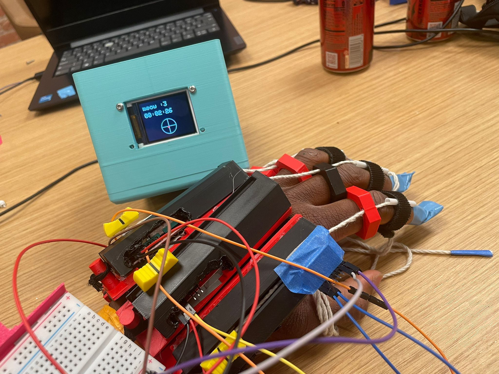
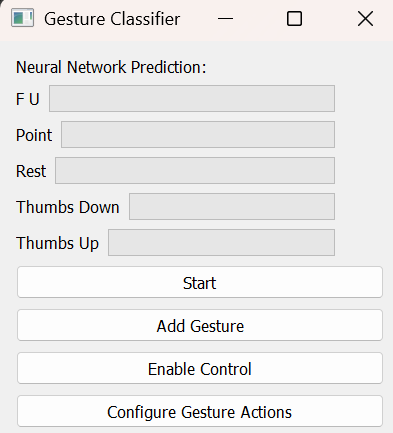
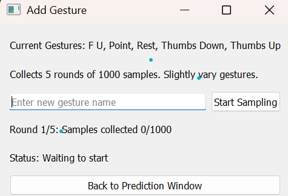
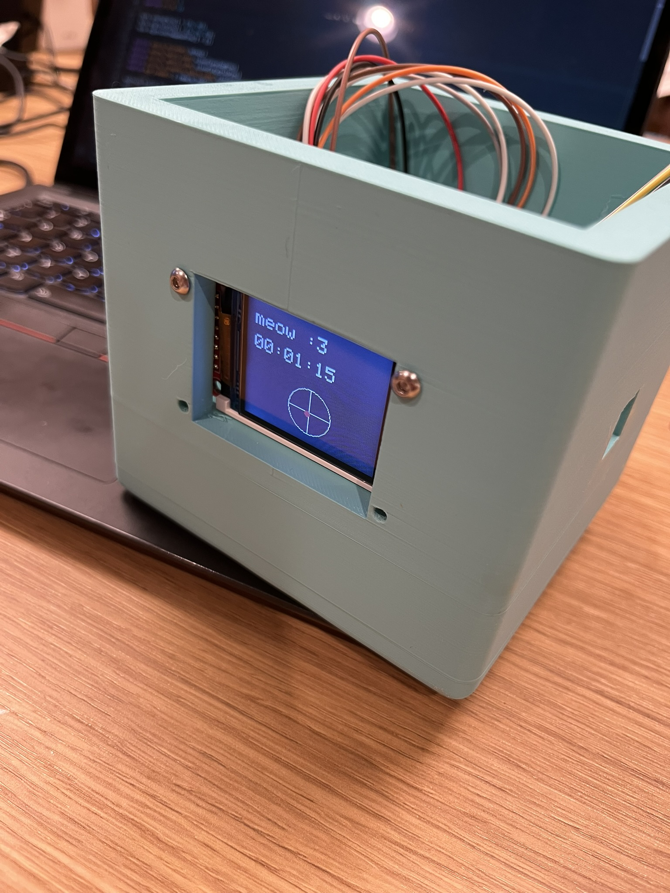
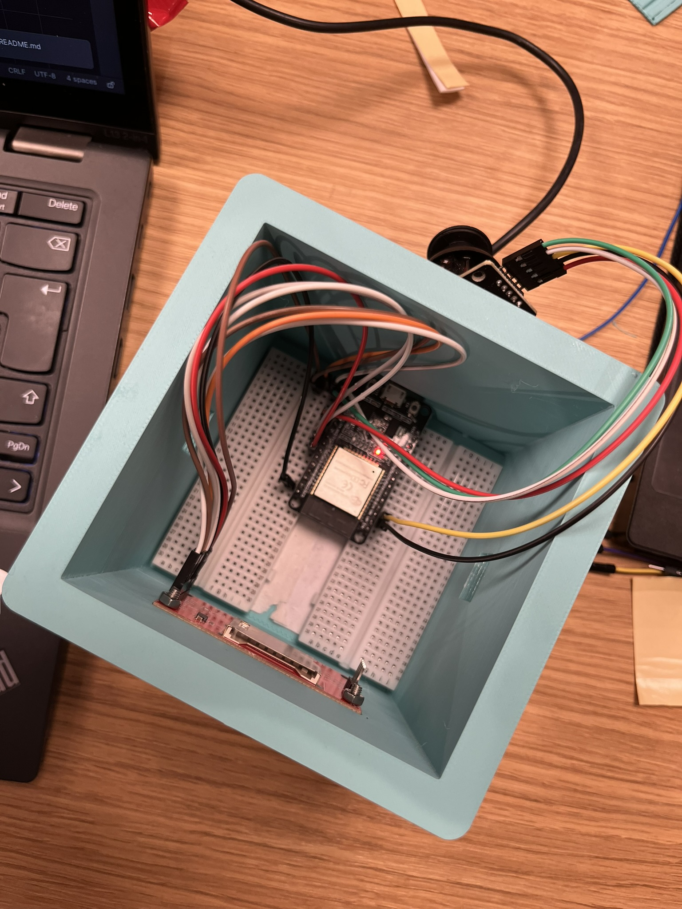
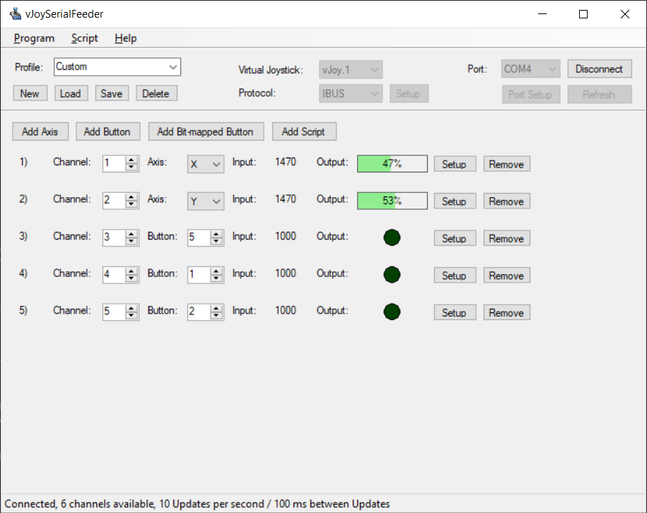
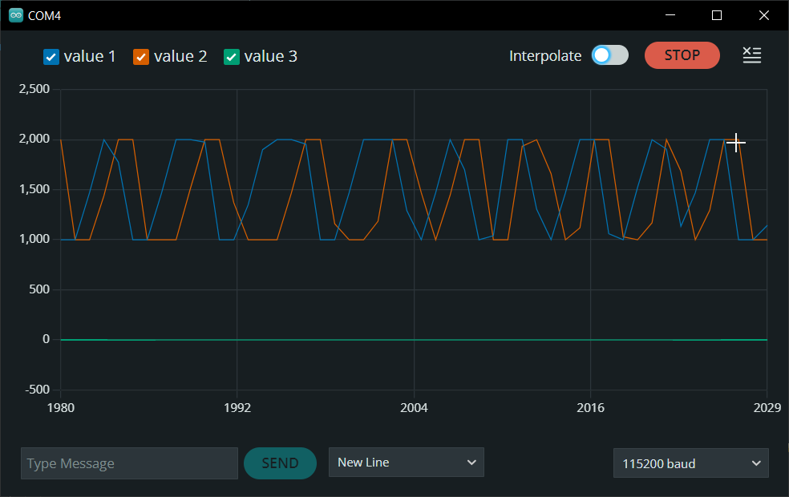
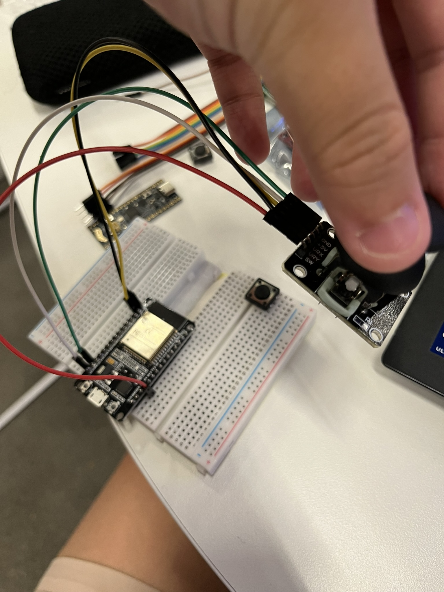

# Crazy Controllers

# -Fully configurable glove machine learning computer interface and joystick

ARE YOU FINDING GAMES TO HARD?
DO YOU STRUGGLE WITH ALL THOSE EXTRA KEYS?
DO YOU WANNA FEEL SPIRITUALLY CONNECTED TO YOUR SCREEN?

Well do we have the product for you with crazy controllers.

Crazy controllers presents two unique ways of controlling the game.

## THE GLOVE.

Inspired by the Nintendo Power Glove we created a gauntlet that is able to recognise different gestures and the position of your hand and recognise the pose your hand is in using an artificial neural network. Allowing you to control your computer and games in ways never before seen making everyday more fun.

We used potentionmeters in the analog sliders and an IMU to allow us to gain knowledge of the current state of the hand the imu providing the detail on the orientation of the hand using its accelerometer and using the analogue sliders in antagonistic pairs in order to find out the extension of each finger as fingers flex the move along the slider and when the fingers return to rest they release the slider is pulled back to 0.

The glove uses an artificial neural network built in tensorflow to classify between different gestures, you can add your own gestures and assign them to computer inputs using a custom python gui.

## THE JOYSTICK.

Complementing the globes, a more portable companion was developed. We went on a little sidequest to also build this cute cube controller using an ESP32 microcontroller, and connected it to a generic joystick breakout module and a 1.8" 160x128 OLED Display. The joystick is controllable in both X and Y axes and has a switch you can click, similar to thumbsticks you'd find on modern controllers.

Getting this to work was a bit tricky since ESP32s don't do USB HID natively (the protocol for controller input), so we experimented with serial feeding via IBus to send the joystick data over serial and used vJoy and vJoySerialFeeder to turn it into a virtual joystick controller that a laptop recognises.

Calibrating the joysticks was super annoying, they never centre exactly and constantly drift (it drifts just by looking at it T-T), so we mapped readings to between 1000 and 2000 (~1500 centre, with a deadzone). The screen displays uptime and a cool live joystick visualiser (perfect for crying at the sight of stick drift :sob:).

For an individual demo of the joystick, see [this](https://www.youtube.com/watch?v=Vyi5VYunwlE) video where I tested it out on my game for Juice (Hack Club) :).

# Progress and Pics

