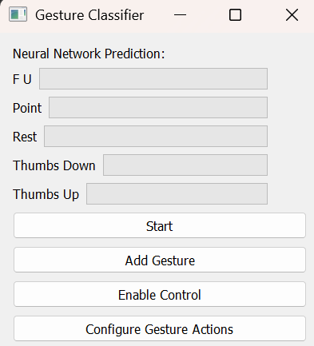
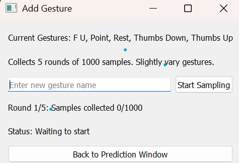

CRAZY CONTROLLERS
-

ARE YOU FINDING GAMES TO HARD? 
DO YOU STRUGGLE WITH ALL THOSE EXTRA KEYS?
DO YOU WANNA FEEL SPIRITUALLY CONNECTECTED TO YOUR SCREEN?

Well do we have the product for you with crazy controllers.

Inspired by the nintendo power glove we created a gauntlet that is able to recognise different gestures and the position of your hand and recognise the pose your hand is in. Allowing you to control your computer and games in ways never before seen making everday more fun

We used potentionmeters in the analog sliders and an IMU to allow us to gain knowlege of the current state of the hand the imu providing the detail on the orentation of the hand using its accelerometer and using the anaglog sliders in antagonistic pairs in order to find out the extension of each finger as fingers flex the move along the slider and when the fingers return to rest they release the slider is pulled back to 0

The glove uses an artificial neural network built in tensorflow to classify between different gestures, you can add your own gestures and assign them to computer inputs using a custom python gui.

Progress images:  

