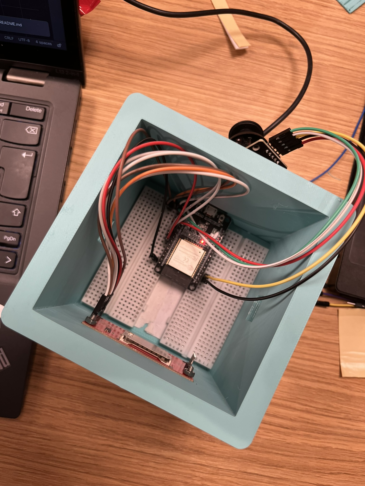
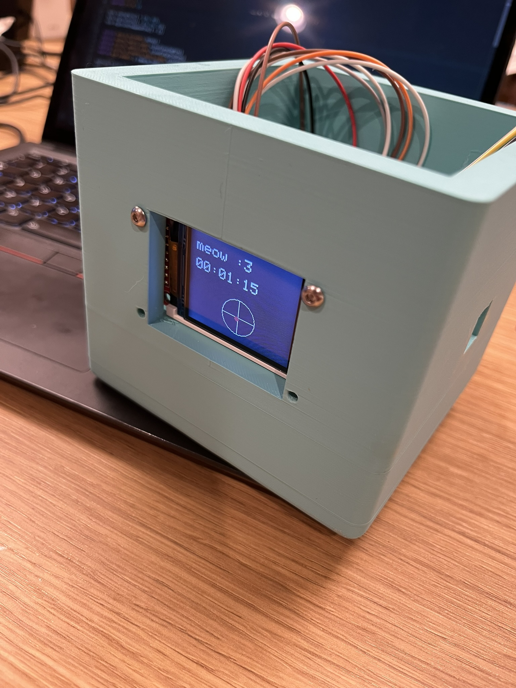

# CrazyControllers

## About this

In combination with the gloves, a more portable companion was developed. We went on a little sidequest to also build this cute cube controller using an ESP32 microcontroller, and connected it to a generic joystick breakout module and a 1.8" 160x128 LCD Display. The joystick is controllable in both X and Y axes and has a switch you can click, similar to thumbsticks you'd find on modern controllers.

Getting this to work was a bit tricky since ESP32s don't do USB HID natively (the protocol for controller input), so we experimented with serial feeding via IBus to send the joystick data over serial and used vJoy and vJoySerialFeeder to turn it into a virtual joystick controller that a laptop recognises.

Calibrating the joysticks was super annoying, they never centre exactly and constantly drift (it drifts just by looking at it T-T), so we mapped readings to between 1000 and 2000 (~1500 centre, with a deadzone). The screen displays uptime and a cool live joystick visualiser (perfect for crying at the sight of stick drift :sob:).

## Preview

### Glove

### Joystick

## BOM

### Glove

| Component                            | Qty | Unit Price (USD) | Total Price (USD) | Link                                                                                                                                                                                                                                                                                                                                                                                                                                                                             | Notes               |
|--------------------------------------|-----|------------------|-------------------|----------------------------------------------------------------------------------------------------------------------------------------------------------------------------------------------------------------------------------------------------------------------------------------------------------------------------------------------------------------------------------------------------------------------------------------------------------------------------------|---------------------|

### Joystick

| Component                            | Qty | Unit Price (USD) | Total Price (USD) | Link                                                                                                                                                                                                                                                                                                                                                                                                                                                                             | Notes               |
|--------------------------------------|-----|------------------|-------------------|----------------------------------------------------------------------------------------------------------------------------------------------------------------------------------------------------------------------------------------------------------------------------------------------------------------------------------------------------------------------------------------------------------------------------------------------------------------------------------|---------------------|
| ESP32-WROOM DevKit                   | 1   | 8.9              | 8.09              | https://www.digikey.com/en/products/detail/espressif-systems/ESP32-DEVKITC-32UE/12091813?gQT=2                                                                                                                                                                                                                                                                                                                                                                                   |                     |
| Generic Joystick Breakout Module     | 1   | 5.99             | 5.99              | https://www.microcenter.com/product/646122/Joystick_Module?gQT=1                                                                                                                                                                                                                                                                                                                                                                                                                 |                     |
| 1.8" SPI 128x160 LCD Display MSP1803 | 1   | 9.99             | 9.99              | https://www.amazon.com/DSD-TECH-Display-Interface-Arduino/dp/B07WDJ3TV6?source=ps-sl-shoppingads-lpcontext&ref_=fplfs&psc=1&smid=AFLYC5O31PGVX&gQT=2                                                                                                                                                                                                                                                                                                                             |                     |
| Half-size Breadboard                 | 2   | 5.00             | 10.00             | https://www.adafruit.com/product/4539?gQT=1                                                                                                                                                                                                                                                                                                                                                                                                                                      |                     |
| MtF Jumper Wires pack (40pcs)        | 1   | 3.99             | 3.99              | https://www.amazon.com/California-JOS-Breadboard-Optional-Multicolored/dp/B0BRTHR2RL?dib=eyJ2IjoiMSJ9.QGbaFF62mgZ1Tf0J7CajkBnivKMOTOpZJUS1O07RvMTdRB_XRaRodQoAK3JDX6nDxwL8P_f-P94ovuQZcqU3woJ3ZyPE7yhWT2z7YYoasootHEPX5DgIE57ZJoYB4HkXYQaADKB7EA1jDiRLdUbdA2u_VK1d_0obJ5vvR9RwWgn_9e7Yu8e5TnRwhHi-HSX0uTEcSBKJD3pmKQDmrpXOtCdm22rGUAqzFxahbk9ECP8.YHDiU8QIWvMJI657TkIXEza6MXC1duYlfiRdmc7D7PA&dib_tag=se&keywords=male%2Bto%2Bfemale%2Bjumper%2Bwires&qid=1752489505&sr=8-4&th=1 |                     |
| 3D Printed Parts                     | 1   | 0.00             | 0.0               | #printing-legion :)                                                                                                                                                                                                                                                                                                                                                                                                                                                              | Printed @ Undercity |
